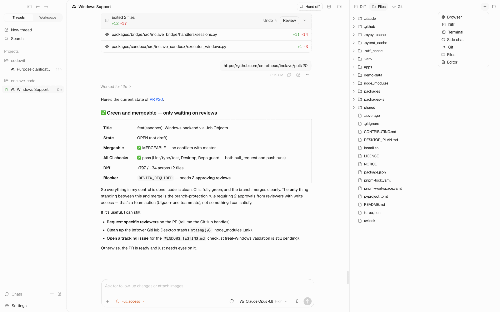

# Codewit

**One minimal desktop app for every AI coding agent.**

Codewit is an open, multi-provider GUI for coding agents — run Claude Code, Codex,
Cursor, Gemini, Grok, Kilo Code, OpenCode and Pi from a single clean, local-first
interface, with built-in chat, diff review, a file explorer + editor, and terminals.

[Download](https://github.com/emretheus/codewit/releases) ·
[Quick start](#quick-start) ·
[Supported agents](#supported-agents) ·
[Contributing](./CONTRIBUTING.md)

## Why Codewit

Most coding-agent tools lock you into a single model. Codewit is **multi-provider by
design** — pick the agent that fits the task, switch between them without losing your
conversation, and keep everything in one fast, local-first desktop app. Your code and
chats stay on your machine.

- **One app, many agents** — no juggling separate terminals or apps per provider.
- **See and edit code in-app** — a real file explorer and editable editor, so you don't
  need to flip to another IDE to review what the agent did.
- **Review before you ship** — inline diffs, working-tree changes, and git actions
  (commit / branch / PR) in one place.
- **Local-first** — state lives in a local database on your machine.

## Supported agents

Codewit auto-detects the provider CLIs you already have installed:

| Agent           | Provider  |
| --------------- | --------- |
| **Claude Code** | Anthropic |
| **Codex**       | OpenAI    |
| **Cursor**      | Cursor    |
| **Gemini**      | Google    |
| **Grok**        | xAI       |
| **Kilo Code**   | Kilo      |
| **OpenCode**    | OpenCode  |
| **Pi**          | Earendil  |

> More providers are on the way. Each provider has its own model options (reasoning
> effort, thinking budget, context window, fast mode).

## Install

> [!WARNING]
> Codewit drives the coding-agent CLIs you already use. Install and authenticate at
> least one provider (e.g. the [Codex CLI](https://github.com/openai/codex) or
> [Claude Code](https://www.anthropic.com)) for the agent you want to run.

| Platform                          | Download                                                              |
| --------------------------------- | --------------------------------------------------------------------- |
| **macOS** (Apple Silicon / Intel) | [Releases page](https://github.com/emretheus/codewit/releases/latest) |
| **Windows**                       | [Releases page](https://github.com/emretheus/codewit/releases/latest) |
| **Linux** (AppImage)              | [Releases page](https://github.com/emretheus/codewit/releases/latest) |

Builds for the current release are on the
[latest release page](https://github.com/emretheus/codewit/releases/latest).

## Quick start

1. Install Codewit and at least one coding-agent CLI.
2. Open Codewit and add a project (a local git repository).
3. Start a new chat, pick a provider + model, and describe the task.
4. Review the agent's changes in the diff view, open files in the editor, and commit /
   open a PR when you're happy.

## Features

- 🔀 **Multi-provider chat** — 8 coding agents, one interface, switch mid-conversation.
- 📂 **File explorer + editor** — browse the worktree and edit files in-app (Monaco).
- 🔍 **Diff review** — per-turn diffs and working-tree changes.
- 🌿 **Git + worktrees** — commit, branch, and open PRs; isolate work in git worktrees.
- 🖥️ **Integrated terminals** — run commands alongside the agent.
- 🌐 **In-app browser** — preview and capture context without leaving the app.
- 🎙️ **Voice input** — dictate prompts.
- 🕰️ **Checkpointing** — every turn is snapshotted for safe review.

## Tech stack

Electron · React · TypeScript · Effect · Vite · Tailwind · Monaco · SQLite. The
marketing site is built with Astro.

## Contributing

Codewit is early and moving fast. Bug fixes and small reliability improvements are
welcome — please read [CONTRIBUTING.md](./CONTRIBUTING.md) and open an issue before
larger changes.

## Community

- 💬 Discord: _coming soon_
- 🐦 X / Twitter: _coming soon_

## License

[MIT](./LICENSE)

## Origins

Codewit began as a fork of [Synara](https://github.com/Emanuele-web04/synara), which
itself started as a fork of [T3Code](https://github.com/pingdotgg/t3code). It has since
become a substantially different product with its own branding, packaging, release
system, provider orchestration, desktop app behavior, and product direction. Codewit is
developed and maintained independently. We're grateful to the upstream projects, whose
MIT-licensed work made this possible.
